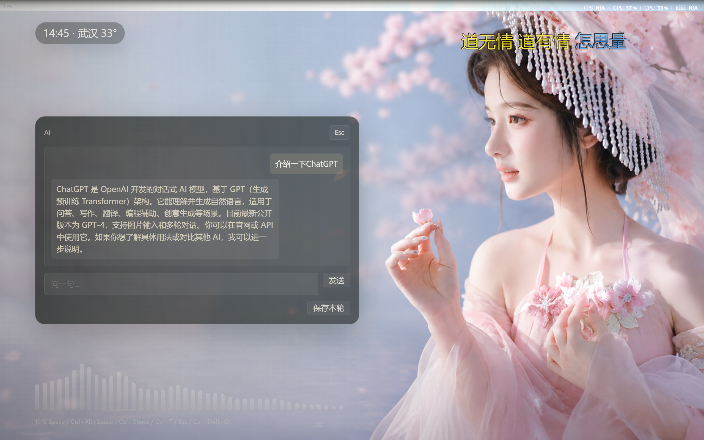

# 静桌 · Silent Desk

> 桌面本来应该是安静的。

静桌是一个运行在 Windows 桌面上的透明覆盖层。它不替换资源管理器，不动任务栏，只是在壁纸上方叠一层——时间、天气、专注状态、音乐频谱、AI 对话，够用就好，不够用再加。

配合 Windows 任务栏自动隐藏使用效果最好：桌面彻底干净，静桌的信息区就是唯一留在屏幕上的东西。

---

<p align="center">
  
</p>

## 为什么做这个

用了很多桌面美化工具，要么太重，要么设计语言和系统格格不入，要么功能多到需要另一个界面去管理它。

静桌的出发点只有一件事：**桌面应该干净、好看，工具随手可用。**

---

## 现在能做什么

- **全屏透明窗口**，默认鼠标穿透，不影响正常操作
- **时间 / 日期 / 天气 / 专注状态**，显示在信息区
- **音乐条**，优先走 WASAPI loopback 采集系统声音；没有声音时静默，不乱跳
- **命令面板** `Ctrl+Space`，支持搜索、方向键、回车执行
- **AI 面板** `Ctrl+T`，后端调用 DeepSeek API，Key 不暴露在前端
- **功能轮盘**，窗口有焦点时长按 `Space` 触发
- **壁纸切换**，支持下一张、切换默认 / 备用文件夹（默认路径见下）
- `Esc` 关闭当前面板并恢复穿透；`Ctrl+Shift+Q` 退出
- 本地配置保存到 `%APPDATA%\Jingzhuo\config.json`

壁纸默认文件夹：
```
D:\BaiduNetdiskDownload\desk_2   （默认）
D:\BaiduNetdiskDownload\desk_1   （备用）
```

---

## AI 扩展方向

静桌的 AI 面板现在是"问答"，但它不打算停在这里。

**近期：鼠标追踪上下文**  
感知光标位置，识别当前聚焦的窗口或选中内容，AI 面板自动带入上下文——不需要手动粘贴，打开就知道你在做什么。

**中期：本地 Agentic 操控**  
通过 Tauri 后端调用系统 API，让 AI 直接执行操作：打开文件、控制窗口、检索本地内容、触发脚本。AI 面板从"给建议"变成"帮你做"。

**长期：桌面级 Agent**  
静桌作为常驻覆盖层，天然是一个低侵入的 Agent 入口。规划中的方向是支持大模型动态生成新的桌面挂件与操作面板——不是预设好的组件，而是根据任务即时生成、用完即走的临时 UI。

当前架构在 Tauri Command 层已预留扩展接口，AI 调用路径与前端完全解耦，后续接入不同模型或本地推理引擎不需要改前端代码。

---

## 技术栈

- **前端**：React + TypeScript + Vite
- **桌面层**：Tauri（Rust）
- **音频采集**：WASAPI loopback
- **AI 后端**：DeepSeek API，通过 Tauri Command 调用

---

## 跑起来

```bash
# 安装依赖
npm install

# 开发模式（完整桌面应用）
npm run tauri:dev

# 只预览前端
npm run dev

# 构建前端
npm run build

# 打包 Windows 可执行文件
npm run tauri:build
```

Tauri 配置：`src-tauri/tauri.conf.json`  
前端构建产物：`dist/`（可删除后重建）

---

## 目录说明

```
/                   主项目
├── src/            前端源码
├── src-tauri/      Rust / Tauri 后端
├── dist/           构建产物（自动生成）
├── new-app/        迁移前备份，不参与构建
├── legacy/         历史参考，不参与构建
└── legacy_archive/ 历史参考，不参与构建
```

---

## 已知限制

- 全局裸 `Space` 未启用，避免和系统输入冲突；长按只在窗口有焦点时生效
- 天气接口目前是城市代码原型模式，正式 SmartWeatherAPI 需要申请并签名
- 音乐条依赖 Windows 默认输出设备，设备不可用时进入静默线

---

## License

MIT
